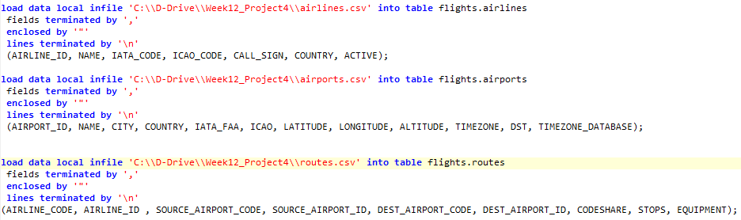

```{r setup, include=FALSE}
knitr::opts_chunk$set(echo = TRUE)
```
```{r set-options, echo=FALSE, cache=FALSE}
options(width = 3000)
```

```{r}
library(RMySQL)
library(mongolite)
```

## <span style="color:blue"><b>NoSQL Migration</b></span>

##### <span style="color:red"><b>The objective of this project is to migrate data from Relational Database (MySQL) to NoSQL Database (MongoDB):</b></span>

##### <span style="color:red"><b>The datasets for this project is downloaded from http://openflights.org/data.html. The data consists of flights information for all airlines in the world. For the purpose of this project, I've selected all flights (airlines, airports, and routes) that have source and destination in the United States.</b></span>

##### <span style="color:red"><b> (1) Download datasets from http://openflights.org. Clean and prepare it to be imported to MySQL database tables airlines, airports and routes. The structure of the database tables is shown here.</b></span>

##### <span style="color:blue"><b>(1.a) Create MySQL Tables</b></span>

<div id="bg">
  
</div>

<div id="bg">
  
</div>

<div id="bg">
  
</div>

##### <span style="color:blue"><b>(1.b) Load data into Airlines Table.</b></span>

<div id="bg">
  
</div>

##### <span style="color:red"><b> (2) MySQL Database Schema</b></span>

##### <span style="color:blue"><b>(2.a) Airlines/Airports/Routes Table Structure.</b></span>

<div id="bg">
  
</div>

##### <span style="color:blue"><b> (2.b) Airlines Table Data</b></span>
<div id="bg">
  
</div>

##### <span style="color:blue"><b> (2.c) Airports Table Data</b></span>
<div id="bg">
  
</div>

##### <span style="color:blue"><b> (2.d) Routes Table Data</b></span>
<div id="bg">
  
</div>

##### <span style="color:red"><b> (3) Connect to MySQL database and fetch data from airlines, airports and routes tables:</b></span>
##### <span style="color:blue"><b>(3.a) Read data into 3 different data frames <i>airlines_df</i>, <i>airports_d</i> and <i>routes_df</i>.</b></span>

```{r}
flightsDB = dbConnect(MySQL(), dbname='flights', host='localhost', user='root', password='root')
dbListTables(flightsDB)

airlines_rs = dbSendQuery(flightsDB, "select * from airlines")
airlines_df = fetch(airlines_rs, n=-1)

airports_rs = dbSendQuery(flightsDB, "select * from airports")
airports_df = fetch(airports_rs, n=-1)

routes_rs = dbSendQuery(flightsDB, "select * from routes")
routes_df = fetch(routes_rs, n=-1)
```
##### <span style="color:blue"><b>(3.b) Check the size of data frames to make sure it retrieved all data from the database tables.</b></span>

```{r}
nrow(airlines_df)
nrow(airports_df)
nrow(routes_df)

head(airlines_df, 10)
head(airports_df, 10)
head(routes_df, 10)
```

##### <span style="color:red"><b> (4) Connect to MongoDB to import data into collections:</b></span>
##### <span style="color:blue"><b>(4.a) Create 3 collections airlines, airports and routes.</b></span>


```{r}
airlines_collection = mongo(collection = "airlines", db="flights", url="mongodb://localhost")
airports_collection = mongo(collection = "airports", db="flights", url="mongodb://localhost")
routes_collection   = mongo(collection = "routes",   db="flights", url="mongodb://localhost")
```


##### <span style="color:blue"><b>(4.b) Insert data from airlines_df, airports_df and routes_df into MongoDB collections.</b></span>
```{r}
airlines_collection$insert(airlines_df)
airports_collection$insert(airports_df)
routes_collection$insert(routes_df)
```

##### <span style="color:blue"><b>(4.c) Find airlines that have code WN.</b></span>
```{r}
airlines_collection$count()
airlines_collection$find('{"IATA_CODE":"WN"}')
```

##### <span style="color:blue"><b>(4.d) Find all distinct airports and find the airport with the code LAX.</b></span>
```{r}
airports_collection$count()
airports_collection$distinct("IATA_FAA")
airports_collection$find('{"IATA_FAA":"LAX"}')
```

##### <span style="color:blue"><b>(4.e) Find all distinct airline codes and all routes that have LAX as source and destination airport.</b></span>
```{r}
routes_collection$count()
routes_collection$distinct("AIRLINE_CODE")
routes_collection$find('{"$and": [{"SOURCE_AIRPORT_CODE": "LAX"}, {"DEST_AIRPORT_CODE": "SFO"}]}')
```

##### <span style="color:blue"><b>(4.f) Display the contents of all collections.</b></span>
<div id="bg">
  
</div>

##### <span style="color:red"><b> (5) Conclusion:</b></span>
<span style="color:blue"><b>(5.a) MongoDB contains collections instead of tables and documents instead of rows in the collections.</b></span>

