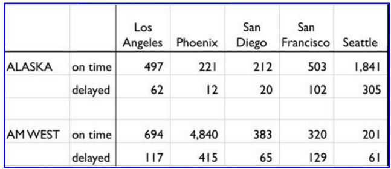

```{r setup, include=FALSE}
knitr::opts_chunk$set(echo = TRUE)
```
```{r set-options, echo=FALSE, cache=FALSE}
options(width = 3000)
```

## Week5 Assignment
##### <span style="color:red"><b> (1) Create a .CSV file (or optionally, a MySQL database!) that includes all of the information above. You’re encouraged to use a “wide” structure similar to how the information appears below, so that you can practice tidying and transformations as described below.</b></span>

<div id="bg">
  
</div>  


```{r}
library(tidyr)
library(dplyr)
library(stringr)
library(sqldf)
library(ggplot2)
```

##### <span style="color:red"><b> (2) Read the information from your .CSV file into R, and use tidyr and dplyr as needed to tidy and transform your data.</b></span>

##### <span style="color:blue"><b> (2.a) Read <i><u>flights.csv</i></u> file and eliminate rows that have blank rows</b></span>
```{r}
flights = read.csv(file="flights.csv", header=TRUE, sep=",")
flights = filter(flights, X.1 != "")
print(flights)
```

##### <span style="color:blue"><b> (2.b) If any row doesn't have the airline name, copy it over from previous row</b></span>
```{r}
for (i in 1:nrow(flights)) {
  if (flights$X[i] == "") {
    flights$X[i] = flights$X[i-1]
  }
}
print(flights)
```

##### <span style="color:blue"><b> (2.c) Apply tidyr <i><u>gather</u></i> function and convert the data from wide to long structure so it can be used for analysis</b></span>
```{r}
flights_df = gather(flights, "City", "OnTime_Delayed", 3, 4, 5, 6, 7 , na.rm = FALSE, convert = FALSE)
```


##### <span style="color:blue"><b> (2.d) Label column as Airlines, OnTime_Delayed, City and Count</b></span>
```{r}
colnames(flights_df) = c("Airlines", "OnTime_Delayed", "City", "Count")
print (flights_df)
```


##### <span style="color:blue"><b> (2.e) Remove punctuation character (.) from City names using regular expression</b></span>
```{r}
flights_df$City = str_replace_all(flights_df$City, "[[.]]", " ")
print (flights_df)
```

##### <span style="color:blue"><b> (2.f) Apply tidyr <i><u>spread</i></u> function to spread the data in column <i><u>OnTime_Delayed</i></u> into 2 different columns: Delayed and OnTime</b></span>
```{r}
flights_df = spread(flights_df, OnTime_Delayed, Count)
colnames(flights_df) = c("Airlines", "City", "Delayed", "OnTime")
print (flights_df)
```

##### <span style="color:blue"><b> (2.g) Create a function to calculate the percentage and round it to 2 decimal digits</b></span>
```{r}
calcPercentage = function(value, totalValue) {
  round((value/totalValue)*100, 2)
}
```

##### <span style="color:blue"><b> (2.h) Apply dplyr <i><u>mutate</i></u> function to add 3 extra columns for <i><u>TotalFlights</i></u>, <i><u>percentOnTime</i></u> and <i><u>percentDelayed</i></u></b></span>
```{r}
flights_df = mutate(flights_df, TotalFlights=(Delayed+OnTime), PercentDelayed=calcPercentage(Delayed, TotalFlights), PercentOnTime=calcPercentage(OnTime, TotalFlights))
print (flights_df)
```

##### <span style="color:red"><b>(3) Perform analysis to compare the arrival delays for the two airlines.</b></span>
##### <span style="color:blue"><b> (3.a) Draw a bar graph that represents the total number of flights for each city</b></span>
```{r}
flights_city_group_df=sqldf("select City, sum(TotalFlights) As TotalFlights from flights_df group by City")
print(flights_city_group_df)
ggplot(flights_city_group_df, aes(x=City, y=TotalFlights)) + geom_bar(fill="#8877aa", color="black", stat="identity")
```

##### <span style="color:blue"><b> (3.b) Draw a bar graph that represents the total number of flights for each airline</b></span>
```{r}
flights_airline_group_df=sqldf("select Airlines, sum(TotalFlights) As TotalFlights from flights_df group by Airlines")
print(flights_airline_group_df)
ggplot(flights_airline_group_df, aes(x=Airlines, y=TotalFlights)) + geom_bar(fill="#87ffaa", color="black", stat="identity")
```

##### <span style="color:blue"><b> (3.c) Draw a bar graph that represents flights delayed for each city separated by each airline</b></span>
```{r}
ggplot(data=flights_df, aes(x=City, y=PercentDelayed, fill=Airlines)) + geom_bar(stat="identity", position="dodge") + 
  ylab("% of Flights Delayed") + ggtitle("% of Flights Delayed")
```  

##### <span style="color:blue"><b> (3.d) Draw a bar graph that represents flights arrived on time for each city separated by each airline</b></span>
```{r}
ggplot(data=flights_df, aes(x=City, y=PercentOnTime, fill=Airlines)) + geom_bar(stat="identity", position="dodge") + 
  ylab("% of Flights OnTime") + ggtitle("% of Flights OnTime") 
```

##### <span style="color:blue"><b> (3.e) Draw a line graph that represents flights delayed for each city separated by each airline</b></span>
```{r}
ggplot(data=flights_df, aes(x=City, y=PercentDelayed, group=Airlines, color=Airlines)) +  geom_line() + 
  geom_point(color = "Red") + ylab("% of Flights Delayed") + ggtitle("% of Flights Delayed") 
```  

##### <span style="color:blue"><b> (3.f) Draw a line graph that represents flights arrived on time for each city separated by each airline</b></span>
```{r}
ggplot(data=flights_df, aes(x=City, y=PercentOnTime, group=Airlines, color=Airlines)) +  geom_line() + 
  geom_point(color = "Blue") + ylab("% of Flights OnTime") +  ggtitle("% of Flights OnTime")
```

##### <span style="color:red"><b> (4) Conclusion.</b></span>
<span style="color:blue"><b>(4.a) From the graphs we can conclude that Alaska airlines has better OnTime performance compared to AMWest airlines though the total number of flights by AM West airlines is more than 2 times as many as Alaska airlines. </b></span>

<span style="color:blue"><b> AM West airlines has a worse performance compared to Alaska Airlines as percentage of flights delayed for each airport is more than Alaska Airlines. Also, we notice that the highest delays by AM West are for San Franciso and the lowest are for Phoenix.</b></span></b></span>
```{r}

```